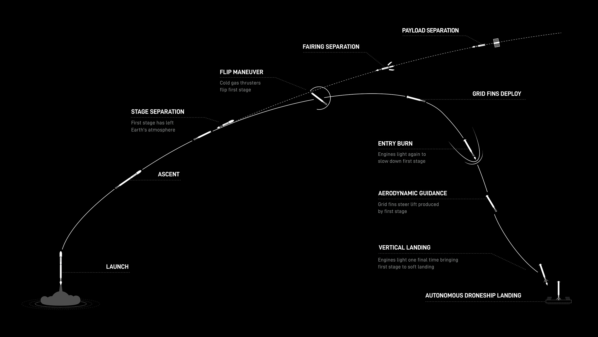
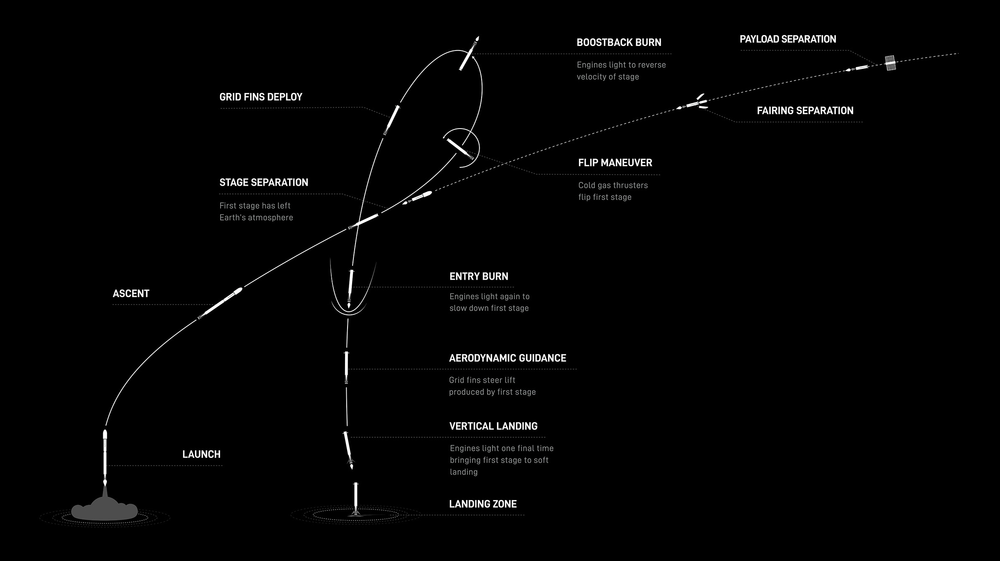
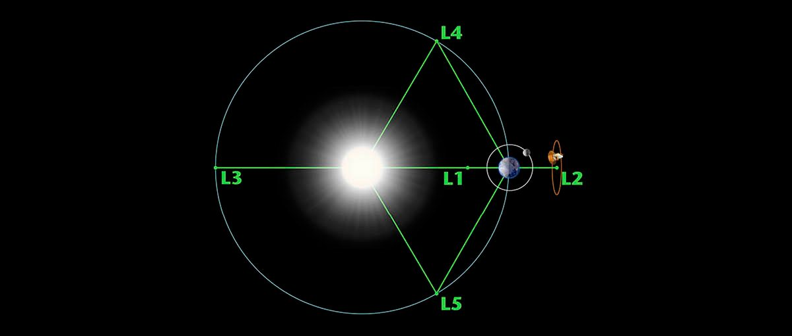

SpaceX, NASA

**SPACE X :** FALCON 9  - **재사용 우주 발사체**

**DroneShip (무인 착륙선)** / **Landing Zone (지상 착륙장)** - *임무에 필요한 성능과 거리에 따라 선택된다*

FALCON 9에는 3단계로 분류된다.

1단계는 발사체의 **엔진**과 **착륙 다리 (Landing Legs)**이다.
착륙 다리는 알루미늄 벌집 모양의 최첨단 탄소 섬유로 4개의 다리가 장착되어있고
로켓의 하단에 배치되고, 착륙 직전에 전개된다.

2단계는 **단일 진공 엔진 (Merlin)**이다. 
구동되는 탑재량을 원하는 궤도로 전달해주며, 발사 후 발사체의 분리 후 몇초 뒤 점화되어 특정 궤도에 배치된다.
또한 다른 궤도로 수정 및 배치 할 수 있는 **재점화**가 가능하다.

3단계는 앞서 말한 **탑재량 (Payload)**이다.
페어링과 드래곤으로 분류되며, 페어링은 위성 등을 실을 수 있으며 드래곤은 사람을 태울 수 있는 유인우주선이다.

그리고 **인터스테이지 (InterStage)**로 탑재량과 발사체를 분리하는 단계로 **그리드 핀 (Grid Fins)**이 있다.
4개의 극초음속 그리드 핀이 장착되어 착륙을 할 수 있게 압력중심을 움직여 재진입을 하는 동안 로켓의 방향을 잡아준다.

__

**NASA** *(유럽우주국 ESA, 캐나다우주국 CSA, STScl 우주 망원경 과학 연구소)* **:** James Webb Space Telescope - **제임스 웹 우주 망원경**

발사일은 **2021년 12월 25일**, 발사체 **아리안 5**로 프랑스령 기아나에 있는 **기아나 우주센터**에서 발사하였다.
발사 약 1개월 뒤 라그랑주점 (라그랑주 포인트) L2에 도착하였다. 

약 6개월 동안의 준비 기간을 거쳐 본격적인 임무를 수행하기 시작하였다.
대표적으로 7월 11일에 공개한 장기간 프로젝트** 제임스 웹 딥필드**를 아주 일부의 일부를 공개하였다.

제임스 웹은 우리가 눈으로 보는 가시광선으로 관측하는게 아닌  훨씬 파장이 긴 **적외선**으로 관측한다.
(허블 우주 망원경을 비유하여 RGB 소개, NIR캠 작동 원리 설명) (600 나노미터 ~ 6 마이크로미터)

__

NASA의 아르테미스 계획은 **21세기 미국의 유인 달 착륙 및 탐사 계획**이다.
아르테미스 계획은 아르테미스 1호, 아르테미스 2호로 나뉘어져 있다.

1호는 무인으로 발사되며 오리온 유인우주선 모듈의 안정성과 기능을 검증할 예정이다.
우주비행사 대신 탐지장치를 장착한 마네킹 더미 3체가 탑재되어 우주비행사들이 우주에서 받을 여러가지 영향들에 대해 계측할 에정이다.

2호는 아르테미스 계획의 2번째 미션으로 아폴로 17호 이후 50여년 만에 처음으로 유인 **스윙바이**를 할 예정이다.
아르테미스 계획 일정이 전반적으로 재조정되면서 발사 예정일이 2023년 8월에서 **2024년 5월**로 연기되었다.

__

**DroneShip**

**Landing Zone**

**Lagrangian Point**

